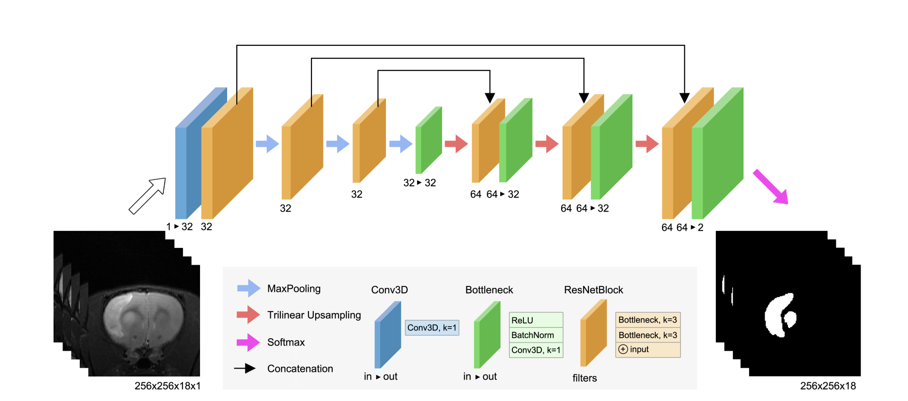

# Final Report of the External Internship at IDIS

## Introduction
The Neuroimaging and Biotechnology Laboratory (NOBEL) at the Health Research Institute (IDIS) is located in the Hospital Clínico Universitario de Santiago de Compostela. The lab conducts neuroimaging analysis tasks aimed at preclinical studies on animal models before human application. The daily work involves preclinical tests on rodents to study the effects of certain substances over time. The goal is to extrapolate these results to relevant human medical information.

During my stay, I worked on obtaining brain maps of rodents through software processing of preclinical MRI to extract relevant data and parameters for precise analysis.

### Magnetic Resonance Imaging
MRI is an indirect method of obtaining images of inaccessible objects like human or rat organs. It uses magnetic fields to obtain precise wave information, allowing reconstruction of two-dimensional images of body interiors.

Under certain assumptions, the application of an external magnetic field to an isolated system containing hydrogen nuclei causes spins to align with the magnetic field, creating net magnetization \( M \), described by the equations:

\[
\begin{cases}
M_x(t)=M_0 e^{-\frac{t}{T_2}} \sin(\omega t), \\
M_y(t)=M_0 e^{-\frac{t}{T_2}} \cos(\omega t), \\
M_z(t)=M_0 (1-e^\frac{-t}{T_1}),
\end{cases}
\]

where \( M_0 \) is the initial value of net magnetization, \( T_1 \) and \( T_2 \) are relaxation times dependent on the sample's structure. This process is crucial for MRI image analysis.

{:style="max-width: 80%;"}
*Figure 1: Illustration showing the tendency of net magnetization to return to the longitudinal axis, making the transverse magnetization null over time.*

In practice, the transverse component decays faster due to local chemical differences and magnetic field inhomogeneities, defined as \( T_2^* \):

\[
T_2^*=\frac{1}{\frac{1}{T_2}+\gamma\Delta B_0}
\]

where \( \gamma \) is the gyromagnetic ratio and \( \Delta B_0 \) is the magnetic field variation. Relaxation times \( T_1 \), \( T_2 \), and \( T_2^* \) depend on water molecule size and hydrophilic molecules, useful for creating images of living specimens.

MRI captures electromagnetic wave information in K-space \( \mathbb{K} \):

\[
(k_x,k_y)(t)=\left(\int_{0}^t\gamma G_x(u)du,\int_{0}^t\gamma G_y(u)du\right)\in\mathbb{K},
\]

where \( G_x \) and \( G_y \) are magnetic gradients. K-space allows image reconstruction using inverse Fourier series.

{:style="max-width: 80%;"}
*Figure 2: K-space of an MRI of a human brain and associated image.*

Processed data are normalized into \( T_1 \), \( T_2 \), and \( T_2^* \) maps, with pixel values indicating relaxation times.

### Analysis of MRI Images
The type of analysis depends on the study and applied magnetic field. Parameters like mean or variance of \( T_1 \), \( T_2 \), and \( T_2^* \) are of interest, helping test hypotheses, such as the impact of radiation on a rat's brain.

{:style="max-width: 80%;"}
*Figure 3: \( T_2^* \) MRI of a rat's brain with 12 slices showing a small lesion in the right frontal area (whiter area).*

It is often useful to crop parts of the image to remove irrelevant information, measuring properties of involved parts.

{:style="max-width: 80%;"}
*Figure 4: Manual segmentation of the lesion shown in Figure 3.*

## Activities Performed
Initially, I familiarized myself with MRI lab processes and theoretical concepts, focusing on image segmentation programming. I began learning Python for its scientific reputation and use in automatic image segmentation. I processed and analyzed MRIs from a study on radiation's impact on rat brain development, using semi-automated software based on ImageJ, transforming raw images to visual formats.

I manually analyzed and segmented each image, searching for tumors or hemorrhages. This time-consuming process is not yet automated at IDIS. I also worked on automating segmentation to reduce operator time and improve quality.

## Challenges Encountered
Processing a single rodent brain can take around 5 minutes for a skilled operator. For a small study with around 15 rodents, about 4 hours are spent on segmentation alone. The Sørensen-Dice coefficient (DICE), indicating overlap between segmentations, shows low inter-observer agreement, highlighting the need for more efficient, automated segmentation methods.

### Proposed Solution
Existing solutions for human brains do not fully apply to rodent brains. I explored artificial neural networks, focusing on the RatLesNetv2 convolutional neural network, due to its promising results. I updated its code for compatibility with Python 3.9 and adapted it for NOBEL's image formats.

I tested the network with IDIS images, but results were unsatisfactory, likely due to differences in image acquisition between IDIS and training data from Charles River lab. Training the network with NOBEL images is necessary but time-consuming. The proposed solution remains available for future implementation.

{:style="max-width: 80%;"}
*Figure 6: Architecture of the RatLesNetv2 convolutional neural network.*

In conclusion, automating segmentation with a trained neural network could significantly reduce processing time and improve segmentation quality.

 The process of setting up the neural network to analyze the IDIS images was the most challenging part. After configuring it, we found that the network, despite yielding results indicating good performance, did not align with the actual segmentation needs. Attempts to adjust the image formats from the lab and slightly modify the network structure did not improve the results. Consequently, I introduced images obtained from other laboratories. These images, while not perfect, provided more satisfactory results, as shown in Figure 6.

{:style="max-width: 80%;"}
*Figure 6: Automatic segmentation of the images from Figure 3 performed by the RatLesNetv2 neural network with training data from homogeneous/model-3. See [GitHub/jmlipman/RatLesNetv2](https://github.com/jmlipman/RatLesNetv2#3-training-and-evaluation).*

The conclusion drawn from this was that there was likely a significant difference between the images obtained at IDIS and those obtained at the Charles River laboratory, where the RatLesNetv2 network was trained. This difference could stem from variations in magnetic fields, receivers, or scanner times, as well as the formats and standards used by the laboratory in terms of the number of slices or image resolutions. This greatly complicates the task, necessitating the neural network to be retrained from scratch with images from the NOBEL lab and their respective segmentations. Considering that this requires hundreds of images, it is a tremendously costly process that could not be completed during my internship. Despite this, the solution has been proposed and is available to the laboratory, which intends to implement it in the future with the necessary resources.

