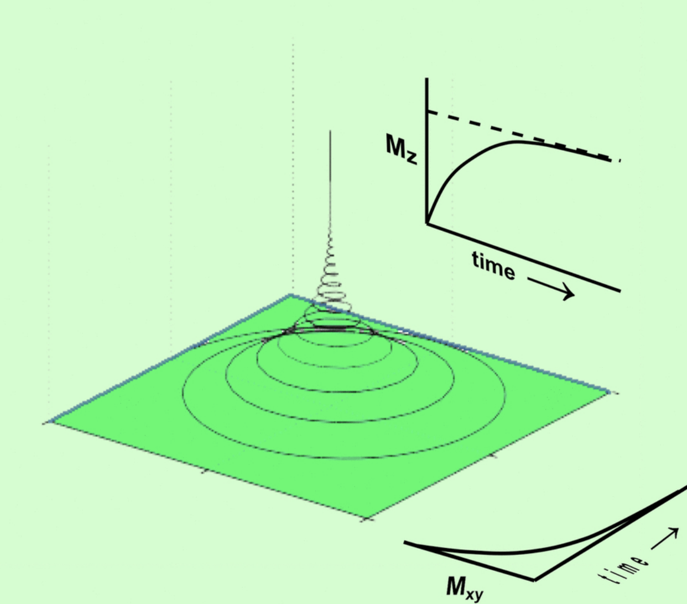
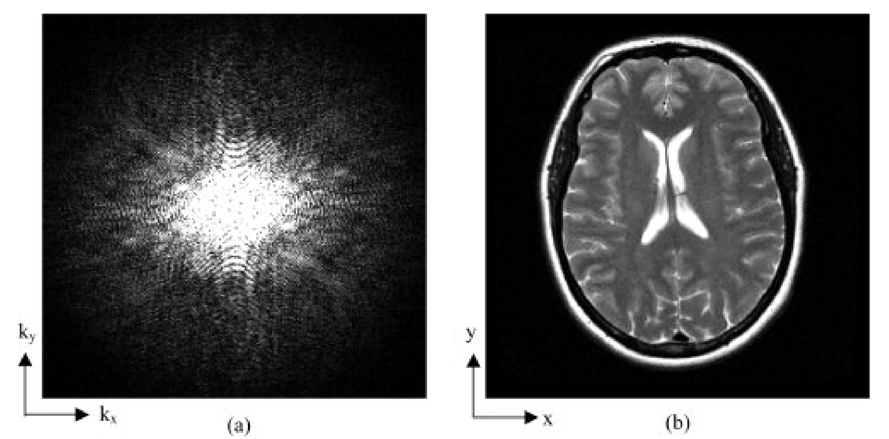
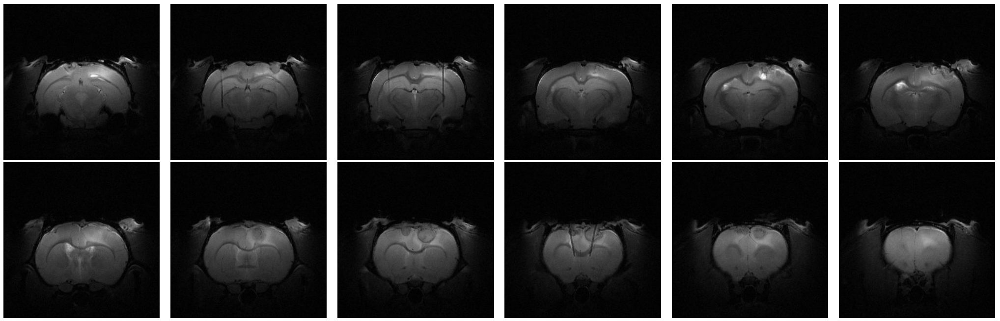

# Roi Vence Nogueira
## Laboratory of Neuroimaging and Biotechnology (NOBEL)  
### Health Research Institute (IDIS)  
**Location:** Hospital Clínico Universitario de Santiago de Compostela  
**Dates:** June 13, 2022 - July 22, 2022  
**Phone:** 667 387 784  
**Email:** roi.vence@gmail.com  

# Final Report of the External Internship at IDIS

## Introduction
The Neuroimaging and Biotechnology Laboratory (NOBEL) at the Health Research Institute (IDIS) is located in the Hospital Clínico Universitario de Santiago de Compostela and conducts neuroimaging analysis tasks aimed at preclinical studies (those carried out in animal models before being transferred to humans). The day-to-day work in the laboratory mainly involves preclinical tests on rodents, conducting studies related to the effects of certain inoculated substances over time. The ultimate goal is to extrapolate the results to relevant medical information about humans. To this end, they have various stations, from those dedicated to image acquisition using methods such as magnetic resonance imaging, to a computerized area for analysis, and operating tables for rodents.

During my stay, I worked on obtaining brain maps of rodents through software processing of preclinical magnetic resonance imaging, for the subsequent extraction of relevant data and parameters for precise analysis.

### Magnetic Resonance Imaging
Magnetic resonance imaging (MRI) is an indirect method of obtaining images of objects inaccessible through conventional lenses, such as human or rat organs. Its foundation is purely physical, using a magnetic field and subsequent transverse magnetic fields to obtain precise wave information about each point in space. This allows the reconstruction of two-dimensional images of the interiors of bodies.

Under certain physical assumptions, as discussed in [source](#), the application of an external magnetic field to an isolated system containing Hydrogen nuclei causes the spins to predominantly align in the direction of the magnetic field. This creates a net magnetization, \( M \), which is the sum of the magnetic moments of all Hydrogen nuclei in the system, described by the following equations over time:

\[
\begin{cases}
M_x(t)=M_0 e^{-\frac{t}{T_2}} \sin(\omega t), \\
M_y(t)=M_0 e^{-\frac{t}{T_2}} \cos(\omega t), \\
M_z(t)=M_0 (1-e^\frac{-t}{T_1}),
\end{cases}
\]

where \( M_0 \) is the initial value of the net magnetization, greater with a stronger external magnetic field, and \( T_1 \) and \( T_2 \) are parameters dependent on the physico-chemical structure of the sample. The times \( T_1 \) and \( T_2 \) represent the time for the transverse components \( M_x \) and \( M_y \) and the longitudinal component \( M_z \) to return to \( 1-\frac{1}{e} \approx 0.63 \) of their equilibrium values. This process is crucial for subsequent MRI image analysis, as explained later.

{:style="max-width: 50%;"}
*Figure 1: Illustration showing the tendency of net magnetization to return to the longitudinal axis, making the transverse magnetization null over time. Image from [source](#).*

In practice, the transverse component \( M_x, M_y \) does not return to \( 1-\frac{1}{e} \) of the equilibrium value within \( T_2 \). Local chemical structure differences and magnetic field inhomogeneities cause this process to be faster. Hence, the observed decay time \( T_2^* \) is defined as:

\[
T_2^*=\frac{1}{\frac{1}{T_2}+\gamma\Delta B_0}
\]

where \( \gamma \) is the gyromagnetic ratio and \( \Delta B_0 \) is the magnetic field variation at the measurement point. \( T_2^* \) is the practical decay time of the transverse component to \( \frac{1}{e} \), often more useful and reliable for studies, requiring more uniform magnetic fields due to greater sensitivity to field irregularities.

Relaxation times \( T_1 \) and \( T_2 \), and thus \( T_2^* \), depend on the amount and size of water molecules and hydrophilic molecules (those tending to chemically combine with water). This theoretical and practical relationship is vital for creating images of living specimens, as detailed in [source](#).

MRI captures electromagnetic wave information, encapsulating all system data in the K-space, \( \mathbb{K} \):

\[
(k_x,k_y)(t)=\left(\int_{0}^t\gamma G_x(u)du,\int_{0}^t\gamma G_y(u)du\right)\in\mathbb{K},
\]

where \( \gamma \) is the gyromagnetic ratio, and \( G_x \) and \( G_y \) are the magnetic gradients. The K-space contains wave information for MRI data, allowing image reconstruction through inverse Fourier series, using methods like the Fast Fourier Transform. K-space data is often halved using theoretical central symmetry, accelerating reconstruction. For more details, see [source](#).

{:style="max-width: 50%;"}
*Figure 2: K-space of an MRI of a human brain and associated image. Image from [source](#).*

Depending on the type of analysis, we process and normalize the above information into \( T_1 \), \( T_2 \), and \( T_2^* \) maps, where each pixel has a value in the range \( [0,1] \) on a grayscale, more intense for longer \( T_1 \), \( T_2 \), or \( T_2^* \) times.

### Analysis of MRI Images
Depending on the study, chemical properties of the components involved, and the applied magnetic field, one of the aforementioned imaging methods may be more useful. After obtaining the desired map, either \( T_1 \), \( T_2 \), or \( T_2^* \), it must be analyzed to extract clinical information. Depending on the study, a wide range of parameters, cuts, or statistical information, such as the mean or variance of \( T_1 \), \( T_2 \), and \( T_2^* \) within an image or between images at different times, may be of interest. This helps to test hypotheses, such as whether \( T_2 \) remains unchanged after irradiating a rat's brain, thereby ruling out tumors or brain diseases due to radiation.

{:style="max-width: 50%;"}
*Figure 3: \( T_2^* \) MRI of a rat's brain with 12 slices showing a small lesion in the right frontal area (whiter area).*

It is often useful to crop certain parts of the image to remove irrelevant information, measuring properties of the parts involved in a process. For instance, segmenting a person's brain to isolate an area affected by a hemorrhage, confirming the presence of the hemorrhage as described earlier.
