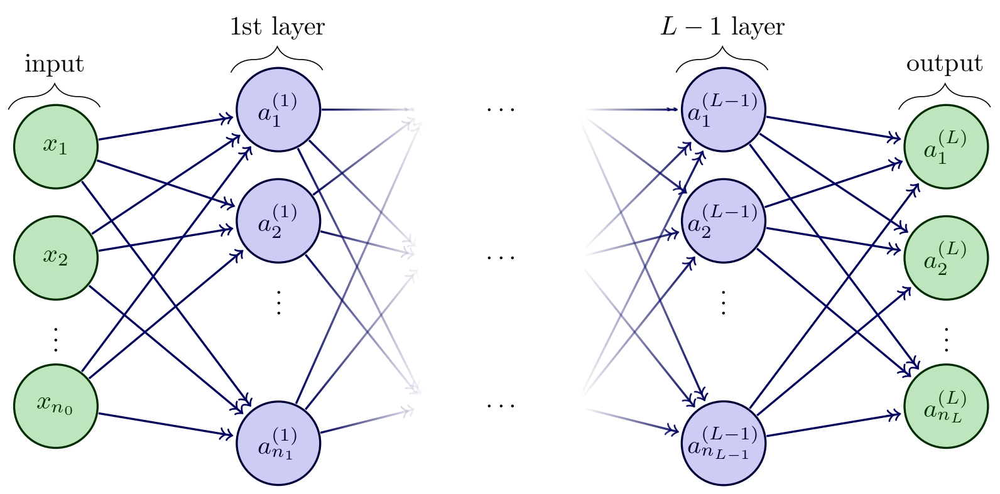
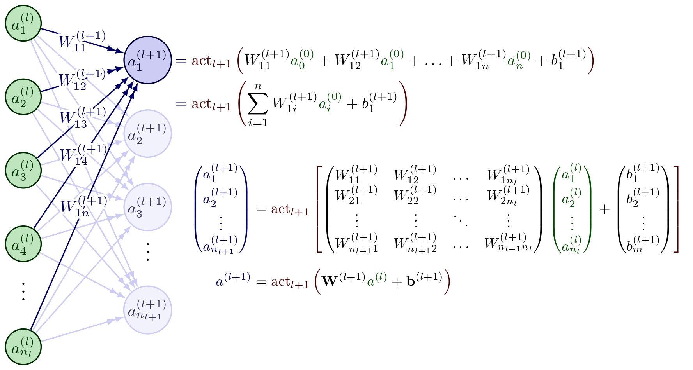
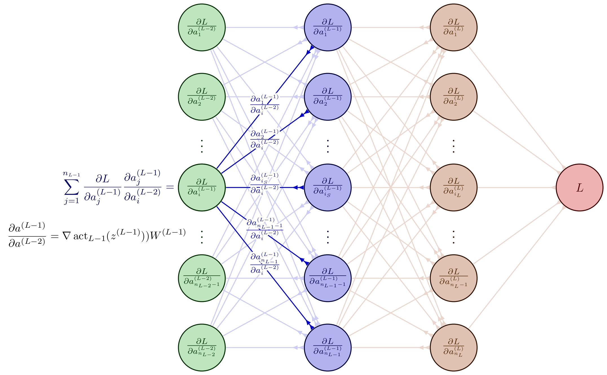
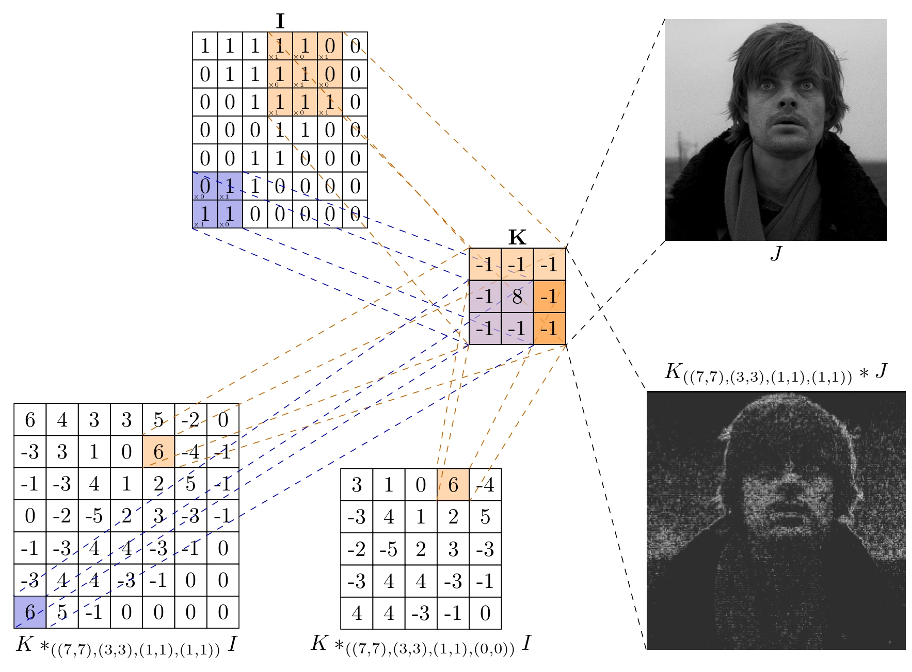
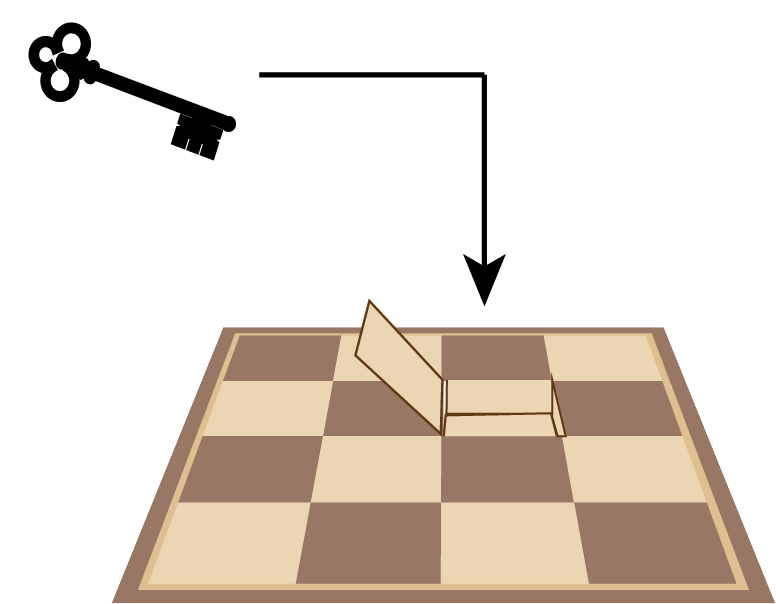

<main role="main" class="container-sm" style="max-width: 1080px">
    

        

            

                
                Roi Vence Nogueira
            

            
About

            
            
{{ bio | markdownify }}

        

        

            

                
                

            

            

                <a href="mailto:roi.vence@gmail.com" title="Email"><i class="fas fa-envelope"></i></a>
                <a href="https://www.linkedin.com/in/roivence" title="LinkedIn"><i class="fab fa-linkedin"></i></a>
                <a href="https://github.com/RoidaVinci" title="GitHub"><i class="fab fa-github"></i></a>
            

            <audio id="myAudio" src="assets/ballade1.mp3"></audio>
        

    

    
    

        

            
Featured Articles

            

                

                    <a href="articles/tfg.html">
                        
                        
Neural Networks and Applications

                    </a>
                

                

                    <a href="articles/nn_graph.html">
                        
                        
Neural Networks as Graphs

                    </a>
                

                

                    <a href="articles/backpropagation.html">
                        
                        
Backpropagation Algorithm

                    </a>
                

                

                    <a href="articles/idis.html">
                        
                        
Neural MRI Segmentation with FCNN

                    </a>
                

                

                    <a href="articles/fft.html">
                        
                        
Fast Fourier Transform and Convolutions

                    </a>
                

                

                    <a href="articles/escape_prison.html">
                        
                        
Two Prisoners and a Chessboard

                    </a>
                

            

            

                <a href="article" class="btn btn-primary view-all-btn">
                    <i class="fas fa-book-open"></i> View All Articles
                </a>
            

        

    

</main>

<!-- JavaScript for playing the music and showing waves -->

<!-- CSS for the wave effect -->

