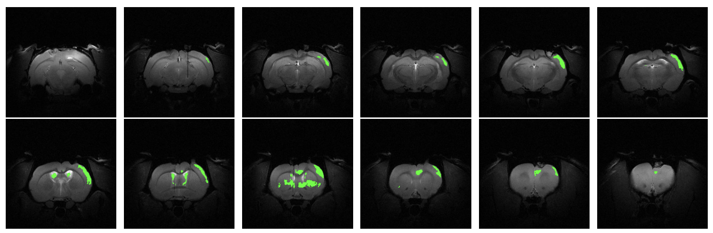

<main role="main" class="container-sm" style="max-width: 1080px">
    

        

            

                
                Roi Vence Nogueira
            

            
About

            
            
{{ bio | markdownify }}

        

        

            <!-- Wrap the profile image in a div to handle the wave animation -->
            

                
                <!-- SVG Wave with multiple paths -->
                <svg class="wave" viewBox="0 0 240 240" width="300" height="300">
                    <path id="wavePath1" d="M120,120" fill="none" stroke="##00008B" stroke-width="2"/>
                    <path id="wavePath2" d="M120,120" fill="none" stroke="##00008B" stroke-width="2"/>
                    <path id="wavePath3" d="M120,120" fill="none" stroke="##00008B" stroke-width="2"/>
                </svg>
            

            

                <a href="mailto:roi.vence@gmail.com" title="Email"><i class="fas fa-envelope"></i></a>
                <a href="https://www.linkedin.com/in/roivence" title="LinkedIn"><i class="fab fa-linkedin"></i></a>
                <a href="https://github.com/RoidaVinci" title="GitHub"><i class="fab fa-github"></i></a>
            

        

    

    
    

        

            
Featured Articles

            

                

                    <a href="articles/tfg.html">
                        
                        
Neural Networks and Applications

                    </a>
                

                

                    <a href="articles/nn_graph.html">
                        
                        
Neural Networks as Graphs

                    </a>
                

                

                    <a href="articles/backpropagation.html">
                        
                        
Backpropagation Algorithm

                    </a>
                

                

                    <a href="articles/idis.html">
                        
                        
Neural MRI Segmentation with FCNN

                    </a>
                

                

                    <a href="articles/fft.html">
                        
                        
Fast Fourier Transform and Convolutions

                    </a>
                

                

                    <a href="articles/escape_prison.html">
                        
                        
Two Prisoners and a Chessboard

                    </a>
                

            

            

                <a href="article" class="btn btn-primary view-all-btn">
                    <i class="fas fa-book-open"></i> View All Articles
                </a>
            

        

    

</main>

<!-- Include the JavaScript here -->

<!-- CSS for styling -->
<link rel="stylesheet" href="https://cdnjs.cloudflare.com/ajax/libs/font-awesome/6.0.0-beta3/css/all.min.css">

